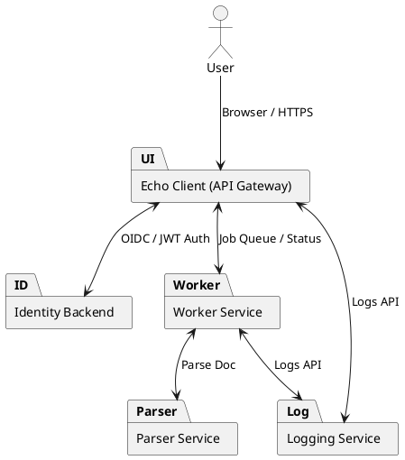
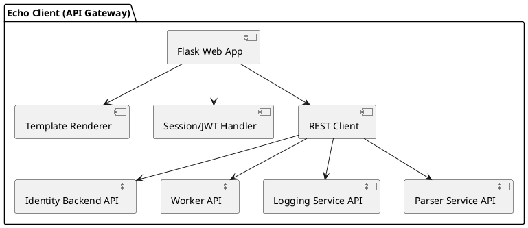
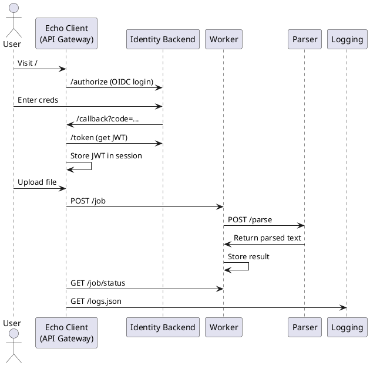
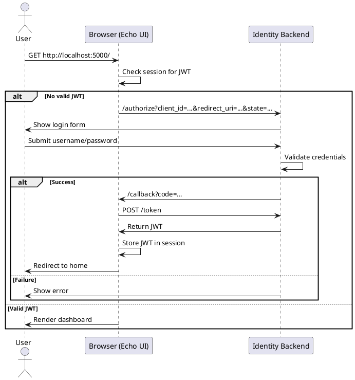
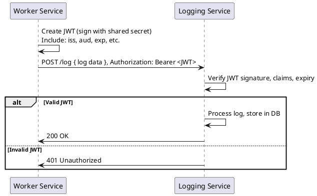

# Echo Client App (API Gateway / Browser UI)

The **Echo client app** is a secure, Flask-based API gateway and user interface for your microservices platform. It provides unified web UI for document upload, RAG querying, job/status monitoring, and integrated Single Sign-On (SSO) authentication.

---

## Overview

- **Web UI**: Upload docs, monitor jobs, run RAG queries, view logs.
- **Authentication**: OAuth2/OIDC (Authorization Code Flow) with identity-backend.
- **Secure Gateway**: Validates JWTs on every user request.
- **Service Orchestration**: Integrates with Worker, Parser, Logging, and Identity microservices.

---

## Architecture Diagrams

### 1. System Context Diagram


<details>
<summary>View PlantUML Source</summary>



</details>

---

### 2. Component Diagram


<details>
<summary>View PlantUML Source</summary>



</details>

---

### 3. REST/Service Call Diagram


<details>
<summary>View PlantUML Source</summary>



</details>

---

### 4. OAuth2/OIDC Login Sequence


<details>
<summary>View PlantUML Source</summary>



</details>

---

### 5. Service-to-Service JWT Auth Sequence


<details>
<summary>View PlantUML Source</summary>



</details>

---

## Environment Variables

Set in `.env` or your deployment environment:

| Variable               | Description                                 | Example/Default                            |
| ---------------------- | ------------------------------------------- | ------------------------------------------ |
| `FLASK_SECRET_KEY`     | Session encryption key (strong, random)     | `super_secret_flask_key`                   |
| `JWT_SECRET_KEY`       | Must match identity-backend                 | `your_shared_secret`                       |
| `JWT_ISSUER`           | Must match identity-backend                 | `https://aurorahours.com/identity-backend` |
| `IDENTITY_BACKEND_URL` | URL of identity-backend                     | `https://aurorahours.com/identity-backend` |
| `CLIENT_ID`            | OIDC client\_id for this app                | `browser-ui`                               |
| `CLIENT_SECRET`        | OIDC client\_secret (from identity-backend) | `dev-client-secret`                        |
| `OPENAI_API_KEY`       | OpenAI (or Ollama) key for RAG queries      | `sk-...`                                   |

---

## Setup

### 1. Install Requirements

```bash
pip install -r requirements.txt
```

* Flask, requests, PyJWT, python-dotenv, etc.

### 2. Configure Environment

Create `.env` or set vars as above.

### 3. Run the App

```bash
python api_gateway.py
```

For production, run with Gunicorn or uWSGI, and always use HTTPS.

---

## Core Features

* **SSO Login:**
  Enforces login via identity-backend (OIDC Authorization Code Flow).
  JWT is stored in session, validated per request.

* **File Upload and Job Queueing:**
  Upload via web form, queue job for Worker, Worker invokes Parser, results returned and shown.

* **RAG Query:**
  User enters question, app gathers parsed docs, calls OpenAI/Ollama API, shows response.

* **Centralized Logging:**
  Logs actions and events via Logging Service; displays logs in a secure admin view.

---

## Endpoints

| Endpoint    | Description                          | Auth Required? |
| ----------- | ------------------------------------ | :------------: |
| `/`         | Home/dashboard (requires login)      |        ✅       |
| `/login`    | Initiate login (redirects to SSO)    |        ❌       |
| `/callback` | Handles auth code, exchanges for JWT |        ❌       |
| `/upload`   | Upload document for processing       |        ✅       |
| `/query-ui` | RAG query interface                  |        ✅       |
| `/logs`     | View logs (admin, restrict in prod)  |        ✅       |

---

## Security

* All secrets must be strong, unique, and never checked into source control.
* JWT signature verification is enforced for all protected routes.
* Session cookies should be set with `Secure`, `HttpOnly`, and `SameSite` flags.
* CSRF protection recommended for all browser form POSTs.
* Logs endpoint must be restricted or disabled in production.

---

## Troubleshooting

* **Token expired**: User must re-login. Session tokens default to 15 minutes.
* **Invalid audience/issuer**: Check env vars, match with identity-backend.
* **Signature verification failed**: Secrets do not match across services.

---

## Updating Diagrams

* Store all PlantUML sources in `/docs/architecture/` in your repo.
* Generate PNGs with PlantUML and link them in this README.

---

## Launching locally

```bash
(base) PS C:\Users\saad0\Documents\source\echo> python api_gateway.py 2>&1 | tee flask.log
```
---

## License

MIT (c) 2025 Saad Aziz and partners
